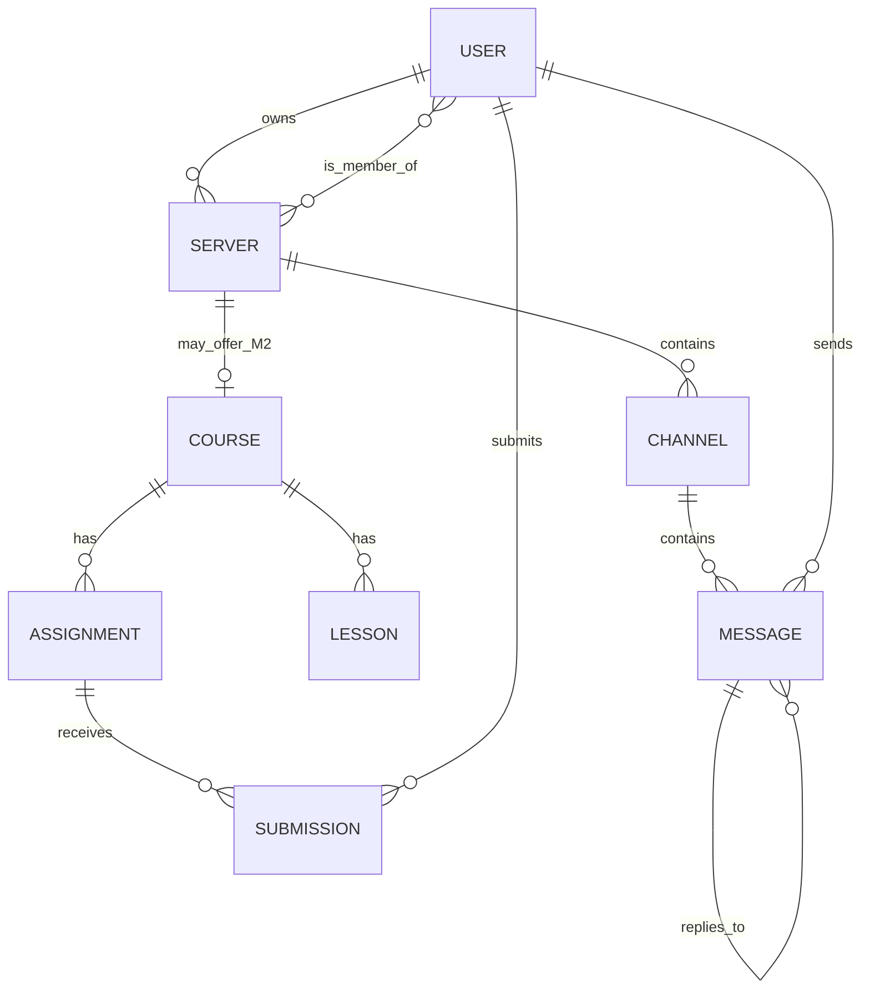

## Database Schema

CMCord dùng **MongoDB + Mongoose**, gồm các collection chính sau:

| Collection | Vai trò | Tham chiếu (ref) |
|---|---|---|
| `User` | Tài khoản người dùng | — |
| `Server` | Nhóm/lớp do người dùng tạo | `owner`, `members` → User |
| `Channel` | Kênh chủ đề trong 1 Server | `server` → Server |
| `Message` | Tin nhắn real-time trong Channel | `channel` → Channel, `sender` → User, `replyTo` → Message |
| `Course` *(Milestone 2)* | Khoá học gắn với 1 Server | `server` → Server |
| `Lesson` *(Milestone 2)* | Bài học trong Course | `course` → Course |
| `Assignment` *(Milestone 2)* | Bài tập trong Course | `course` → Course |
| `Submission` *(Milestone 2)* | Bài nộp của sinh viên | `assignment` → Assignment, `student` → User |

### Quyết định thiết kế

- **Tham chiếu (reference), không nhúng (embed):** `Message` là collection riêng thay vì mảng lồng trong `Channel`, tránh document phình to vượt giới hạn 16MB của MongoDB khi lịch sử chat dài.
- **`Server.owner` + `Server.members`** kiểm soát quyền truy cập vào Channel/Message bên trong server đó; `inviteCode` phục vụ endpoint `POST /api/servers/join`.
- **Index đề xuất:** `Message` nên đánh composite index `(channel, createdAt)` để phân trang lịch sử chat nhanh; `User.email` nên có unique index cho đăng ký/đăng nhập.
- **Real-time không có bảng riêng:** Socket.io chỉ phát lại (emit) document `Message` vừa được lưu qua Mongoose — MongoDB là nguồn dữ liệu chuẩn (source of truth), Socket.io chỉ là kênh đẩy dữ liệu real-time tới client.

> Lưu ý: sơ đồ trên được suy ra từ danh sách model trong `AGENTS.md`, các API endpoint trong README và các tính năng đã hoàn thành — nên đối chiếu lại tên field/index thật trong `server/src/models/` trước khi coi đây là tài liệu chính thức.
